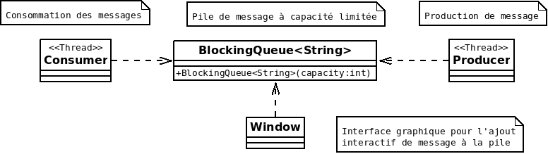

# Illustration du principe d'inversion de contrôle

Cadre : Présentation des patrons de conception (se référer à des ressources dédiées pour apprendre Spring).

## Problème

On veut pouvoir <span style="font-weight: bold">configurer</span> la construction d'un ensemble d'objets présentant des dépendances.

## Solution : Injection de dépendance

* Configurer l'appel aux constructeurs et aux accesseurs qui établissent les relations entre les objets.
* Déléguer la construction des objets et la définition des relations à un framework

## Exemple (ce code)

On dispose d'un ensemble de classe :



On veut créer une application avec une pile de message (identifiée par "queue") partagée par :

* Un Thread de production de message (Producer) qui empile des messages à traiter et s'arrête
* Un Thread de consommation (Consumer) des messages de la "queue".
* Une IHM (Window) qui permet à l'utilisateur d'ajouter manuellement des messages à la pile.

Mieux : On veut démarrer les Thread au démarrage de l'application.

## Mise en oeuvre avec Spring

Un contexte spring ApplicationContext (qui hérite de BeanFactory) est initialisé à l'aide d'un fichier XML qui fait partie des ressources du programme :

```
// Initialisation du contexte spring
@SuppressWarnings("resource")
ApplicationContext context = new ClassPathXmlApplicationContext("/spring/beans.xml");
```

L'ApplicationContext exploite le fichier XML [/src/main/resources/spring/beans.xml](src/main/resources/spring/beans.xml) qui contient les informations nécessaires à la construction des objets (inversion de contrôle) et à la définition des relations entre ces objets (injection de dépendances).

## Démonstration

* ```mvn package exec:java```
* Suivre les logs dans la console
* Jouer avec l'interface

(Le main est dans la classe Application)

## Comment ça marche?

L'initialisation des objets va s'appuyer massivement sur les concepts d'introspection et de réflexion supportés par le langage Java.

### Création de l'objet "queue"

```
<bean id="queue" class="java.util.concurrent.ArrayBlockingQueue">
	<constructor-arg index="0" type="int" value="5" />
</bean>
```
 
* Récupération de la classe ```java.util.concurrent.ArrayBlockingQueue``` par son nom
* Récupération du constructeur ```ArrayBlockingQueue(int)``` 
* Appel du constructeur avec un entier de valeur 5
* Stockage du bean dans une ```beans: Map<String,Object>```

### Création d'un objet "consumer" de type "Consumer"

```
<bean id="consumer" class="org.acme.ioc.Consumer" 
	init-method="start" 
	destroy-method="interrupt"
>
	<property name="queue" ref="queue"></property>
</bean>
```

* Construction d'une instance de la classe ```org.acme.ioc.Consumer```
* Passage d'une référence au bean "queue" par appel de la méthode ```setQueue```
* Appel d'une méthode d'initialisation ```start``` (Consumer est un Thread)

Remarque : 

* Par défaut, le framework recherche un constructeur sans paramètre. 
* [Un bean doit normalement posséder un constructeur sans paramètre](http://www.jmdoudoux.fr/java/dej/chap-javabean.htm).

## Manipulation par programmation de l'ApplicationContext

L'ApplicationContext peut être manipulé par programmation, par exemple pour récupérer 
les beans par leur nom.

```
Window window = (Window) context.getBean("window");
window.setVisible(true);
```

## Impact au niveau du programme

* La configuration de l'application est gérée au niveau framework (voir utilisation avec DataSource JDBC).
* Dans la mesure où il est possible d'appeler des méthodes à l'initialisation, le framework.
peut prendre le contrôle de l'ensemble de l'exécution (Inversion de contrôle).
* Imaginer qu'il faille ajouter un "proxy" dans un "httpClient" initialisé au niveau du framework.

## Allez plus loin

* Comprendre la notion de [scope](http://www.tutorialspoint.com/spring/spring_bean_scopes.htm) (singleton par défaut)

* Consulter la documentation de Spring : [Vue d'ensemble de spring](http://docs.spring.io/spring/docs/current/spring-framework-reference/html/overview.html#overview-modules)

## Variante en Java (ServiceLoader)

L'API java intègre un [ServiceLoader](https://docs.oracle.com/javase/7/docs/api/java/util/ServiceLoader.html) qui offre la possibilité de récupérer des instances implémentant une interface.

Les instances à créer pour une interface ```org.acme.Format``` sont listées dans un fichier ```main/resources/META-INF/services/org.acme.Format``` :

```
org.acme.format.WKT
org.acme.format.WKB
```

Remarques : 

* Les classes doivent impérativement offrir un constructeur par défaut
* Ce principe est souvent utilisé pour la production de système "plugable". 

Exemple : [Plugin pour la lecture des shapefile dans Geotools](https://github.com/geotools/geotools/blob/master/modules/plugin/shapefile/src/main/resources/META-INF/services/org.geotools.data.DataStoreFactorySpi).

* Attention à bien concaténer ces fichiers si vous formez un jar qui embarque un ensemble de dépendances!


## Variante en PHP avec Symfony2

PHP dispose aussi d'introspection et de réflexion. Symfony2 se repose massivement sur le concept d'injection de dépendances : 

* ApplicationContext (Spring) <~> [ServiceContainerInterface](http://symfony.com/doc/2.7/book/service_container.html) (SF2)
* Bean (Spring) <~> Service (SF2)

En revanche, on trouvera une moins grande richesse dans les [scopes](http://symfony.com/doc/2.7/cookbook/service_container/scopes.html#understanding-scopes), notamment en raison du cycle de vie d'une application PHP.


